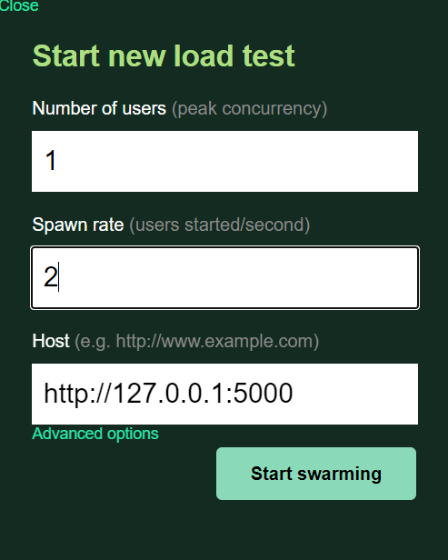
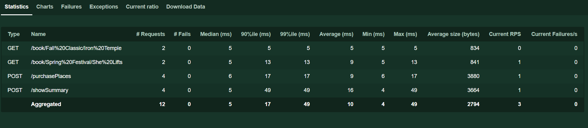
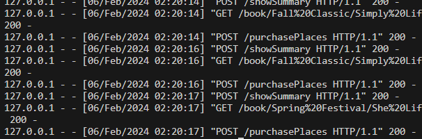

### Tests de Performance avec Locust

Ce projet utilise Locust pour effectuer des tests de performance sur une application web simulée. Le script `TestPerformance` simule le comportement des utilisateurs en effectuant des requêtes HTTP à différentes routes de l'application, telles que `/showSummary`, `/book`, et `/purchasePlaces`.

### Installation

1. Assurez-vous d'avoir Python installé sur votre système. Vous pouvez le télécharger sur [python.org](https://www.python.org/).

2. Installez Locust en utilisant pip :

    ```
    pip install locust
    ```

3. Accédez au répertoire du projet :

    ```
    cd nom-du-depot
    ```

4. Installez les dépendances requises en exécutant :

    ```
    pip install -r requirements.txt
    ```

### Configuration

1. Assurez-vous d'avoir les fichiers de données `competitions.json` et `clubs.json` dans le répertoire du projet, contenant les informations sur les compétitions et les clubs respectivement.

2. Le script `TestPerformance` utilise ces fichiers de données pour simuler les actions des utilisateurs. Assurez-vous que les données sont correctement formatées et accessibles.

### Utilisation

1. Lancez Locust en exécutant la commande suivante dans le répertoire du projet :

    ```
    locust -f test_performance.py
    ```

2. Ouvrez un navigateur et accédez à l'interface web de Locust à l'adresse [http://localhost:8089](http://localhost:8089).

3. Entrez le nombre d'utilisateurs à simuler et la cadence de spawn dans les champs appropriés.

4. Cliquez sur le bouton "Start swarming" pour commencer les tests de performance.

### Interprétation des Tests dans Locust

Une fois les tests de performance en cours d'exécution, Locust affiche plusieurs métriques pour évaluer les performances de l'application :

- **Nombre de Requêtes par Seconde (RPS)** : C'est le nombre de requêtes HTTP envoyées à l'application par seconde.
  
- **Temps de Réponse Moyen** : C'est la moyenne des temps de réponse de toutes les requêtes effectuées par les utilisateurs simulés.

- **Utilisation du CPU et de la Mémoire** : Locust affiche également l'utilisation du CPU et de la mémoire de votre système pendant les tests.

- **Graphiques en Temps Réel** : Locust génère des graphiques en temps réel pour visualiser les métriques de performance pendant les tests.


**Assurez vous que le server Flask soit lancé, dans le cas contraire les requêtes seront refusées expressement par l'ordinateur**

```
1 utilisateur
2 secondes par mis a jour (requete par seconde)
- ensuite entrer le lien du site (http://127.0.0.1:5000/)
```


```
#RESULTAT
```



```
Dans votre terminal, vous remarquerez qu'effectivement les requêtes sont effectuées
```

